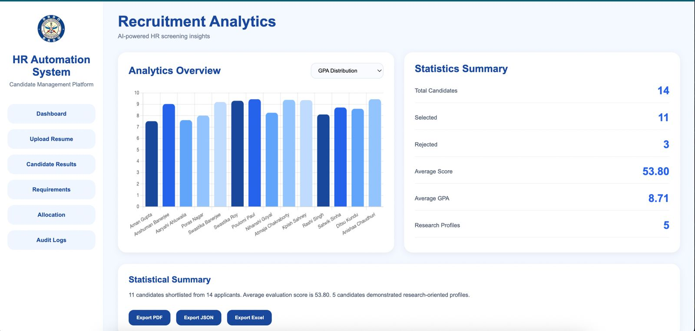
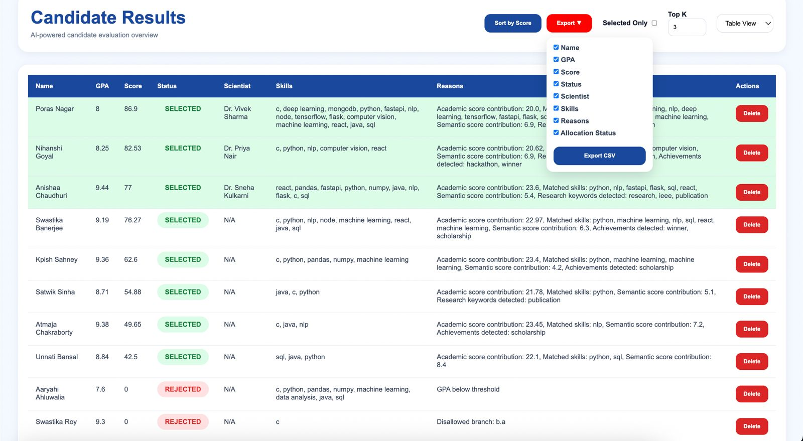
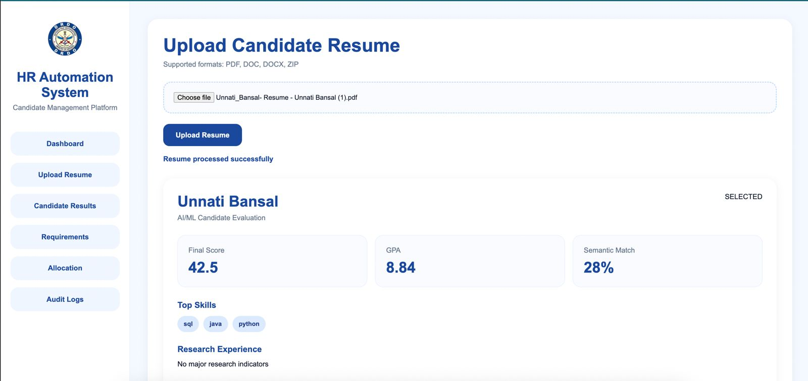
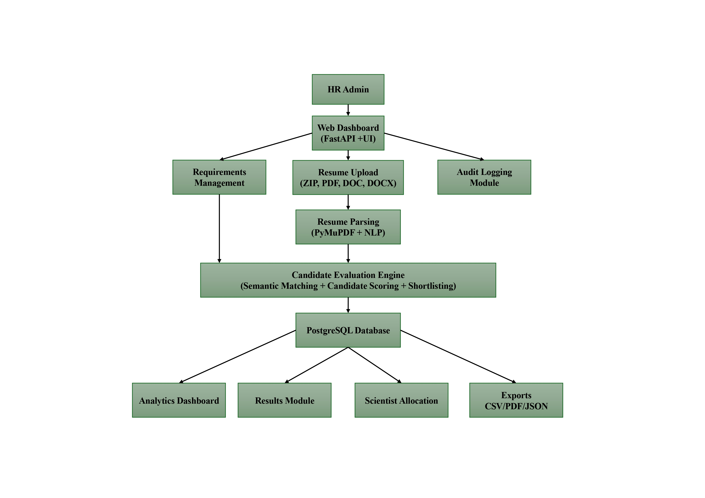

# HR Automation & Candidate Management System

## Overview

The HR Automation & Candidate Management System is an AI-assisted recruitment platform developed to automate resume screening, candidate evaluation, shortlisting, scientist allocation, analytics generation, and audit monitoring.

The system is designed for secure internal deployment and assists HR teams in reducing manual effort during candidate evaluation while improving consistency and transparency in recruitment decisions.

---

# System Screenshots

## Analytics Dashboard



## Candidate Results



## Candidate Evaluation



# Key Features

## Resume Processing

- PDF resume upload
- Bulk ZIP resume upload
- Candidate name extraction
- Academic score extraction
- Skills extraction
- Resume section identification
- Research experience detection

---

## AI-Powered Candidate Evaluation

- NLP-based resume analysis
- Semantic project matching
- Requirement-based candidate scoring
- Automated candidate ranking
- Selection and rejection decisions
- Evaluation reasoning generation

---

## Candidate Management

- Candidate results dashboard
- Card View and Table View
- Score-based sorting
- Selected-only filtering
- Top-K candidate highlighting
- Candidate deletion support

---

## Scientist–Intern Allocation

- Scientist database management
- Dynamic scientist creation
- Specialization-based allocation
- Top-K candidate allocation support
- Allocation status tracking
- Scientist capacity management
- Division-wise assignment display

---

## Analytics Dashboard

Interactive recruitment analytics including:

- Selection vs Rejection statistics
- GPA analysis
- Skills frequency distribution
- Research profile insights
- Candidate score analysis

Built using Chart.js visualizations.

---

## Reporting & Export

### Candidate Reports

- CSV export
- Selectable export columns
- Custom report generation

### Analytics Reports

- Multi-page PDF generation
- Dashboard chart export

### Audit Reports

- CSV export
- PDF export

---

## Audit Logging

Tracks important administrative activities:

- Login attempts
- Logout events
- Candidate uploads
- Candidate deletions
- Administrative actions

Includes:

- Audit filtering
- Audit export
- Audit cleanup functionality

---

# System Architecture

```text
Resume Upload
      │
      ▼
Resume Parsing
      │
      ▼
Skill & Academic Extraction
      │
      ▼
Semantic Matching Engine
      │
      ▼
Candidate Evaluation
      │
      ▼
Database Storage
      │
      ├────────► Results Dashboard
      │
      ├────────► Analytics Dashboard
      │
      ├────────► Scientist Allocation
      │
      └────────► Audit Logging
```

---

# System Architecture




# Technology Stack

## Backend

- Python
- FastAPI
- Uvicorn
- SQLAlchemy

## Frontend

- HTML
- CSS
- JavaScript

## Database

- PostgreSQL

## AI / NLP

- spaCy
- Sentence Transformers
- Scikit-Learn

## Visualization

- Chart.js
- html2canvas
- jsPDF

## Resume Parsing

- PyMuPDF (fitz)

## Authentication

- Session Middleware
- Passlib
- bcrypt

## Version Control

- Git
- GitHub

---

# Project Structure

```text
hr-automation-system/

├── backend/
│   ├── app.py
│   ├── models.py
│   ├── database.py
│   ├── auth_db.py
│   ├── serializers.py
│   ├── audit.py
│   └── services/
│       ├── parser.py
│       └── nlp_engine.py
│
├── frontend/
│   ├── css/
│   ├── js/
│   └── pages/
│
├── data/
│   ├── resumes/
│   └── demo/
│
├── requirements.txt
└── README.md
```

---

# Installation

## Clone Repository

```bash
git clone https://github.com/anishaachaudhuri/hr-automation-system.git

cd hr-automation-system
```

---

## Create Virtual Environment

```bash
python -m venv venv
```

Activate environment:

### Windows

```bash
venv\Scripts\activate
```

### macOS/Linux

```bash
source venv/bin/activate
```

---

## Install Dependencies

```bash
pip install -r requirements.txt
```

---

## Configure PostgreSQL

Create database:

```sql
CREATE DATABASE hr_automation;
```

Update database connection settings inside:

```text
backend/db.py
```

---

## Run Application

```bash
uvicorn backend.app:app --reload
```

Application will start at:

```text
http://127.0.0.1:8000
```

---

# Default Workflow

1. Login as administrator
2. Configure recruitment requirements
3. Upload resumes individually or as ZIP
4. System evaluates candidates
5. Review candidate results
6. Select Top-K candidates
7. Perform scientist allocation
8. Analyze recruitment statistics
9. Export reports
10. Monitor audit logs

---

# Current Capabilities

✅ Resume Parsing

✅ Semantic Candidate Evaluation

✅ Candidate Ranking

✅ Top-K Highlighting

✅ Scientist Allocation

✅ Analytics Dashboard

✅ Candidate Export

✅ Analytics PDF Export

✅ Audit Logging

✅ ZIP Resume Upload

✅ PostgreSQL Integration

---

# Authors

### Anishaa Chaudhuri

B.Tech Computer Science Engineering

Amity University, Uttar Pradesh

---

### Paridhi Sharma

B.Tech Computer Science Engineering

Banasthali Vidyapith, Rajasthan

---

# Internship Project

Developed as part of the Summer Internship Program at:

**Solid State Physics Laboratory (SSPL), DRDO**

Delhi, India
